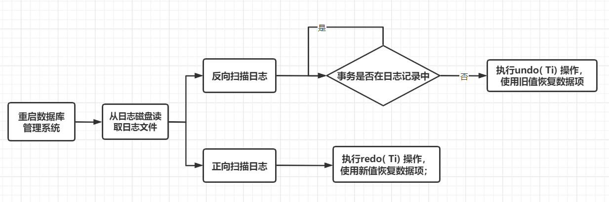
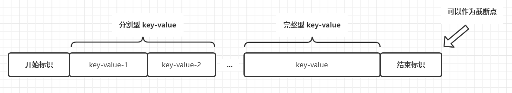
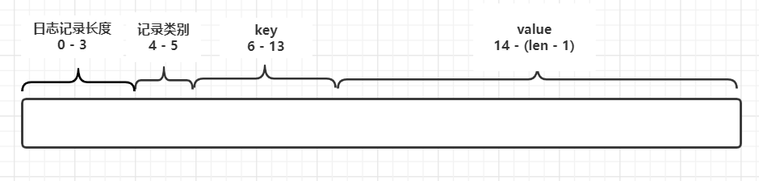

# 数据库故障与恢复实现思路和方案设计

## 一、实现思路

### 1.1 故障类型

|        | 故障描述                                                     | 恢复策略                       |
| ------ | ------------------------------------------------------------ | ------------------------------ |
| 类型一 | 发生系统故障时，事务未提交                                   | 强行撤消（UNDO）所有未完成事务 |
| 类型二 | 发生系统故障时，事务已提交，但缓冲区中的信息尚未完全写回到磁盘上 | 重做（REDO）所有已提交的事务   |

### 1.2 具体方法




​                                                                     图 1 - 具体方法

* 对于类型一的故障，本项目保证了在项目写入日志后才进行持久化，因此不会出现存在在日志中的记录没有持久化的情况，故不考虑；
* 对于类型二的故障，本项目采用 redo log 的方式完成故障恢复，即正向扫描日志记录，使用日志记录中的新值恢复数据。

### 1.3 性能改进

* 影响性能因素：日志记录中存在大量日志数据，如果每次从头恢复耗时耗力
* 解决方案：采用截断点的方式进行优化。截断点之前的数据能保证以事务为单位完成持久化。定期设置和更新截断点，每次故障恢复时从截断点开始恢复即可，能大大减少日志扫描恢复的事件消耗。


```
参考博客：https://blog.csdn.net/dingding_12345/article/details/50471224
```

## 二、方案设计

### 2.1 日志内容



​                                                                  图 2 - 日志内容

### 2.1 日志格式



​																图 3 - 日志记录格式

* 单条日志最大长度不超过 128 byte；
* 0 - 3 以 int 类型记录本条日志的长度（不包括 int 数值本身长度）；
* 4 - 5 以两个 byte 记录本条日志的类型，解释如下：

| 类型名称                            | 数据值 | 解释                                                         |
| ----------------------------------- | ------ | ------------------------------------------------------------ |
| 事务开始标识日志记录                | 10     | 标志着事务的开始，存储了事务 ID，后继日志记录为该事件提交的数据（不一定已经持久化） |
| 事务结束标识日志                    | 11     | 标志着事务的结束， 存储了事务ID，后继日志记录为新的事件开始记录。同时也由此类标识记录判断是否能成为截断点 |
| 无后继日志记录的 key-value 记录日志 | 00     | 完整 key-value 的记录日志或者有一个分割 key-value 记录的最后一条日志 |
| 有后继日志记录的 key-value 记录日志 | 01     | 一个分割 key-value 记录日志                                  |

* 6 - 13 为 key-value 日志记录的 key 值或开始/结束标识记录日志的 txID 即事务 ID；
* 14 之后是 key-value 类型日志记录的 value 值，value 值不定长，由单条日志总长度减去其他类型字段长度可以求得，但由于每条记录限制在128 byte 以内，参考计算机网络报文传输数据分组的方式，对 value 进行分割记录。
